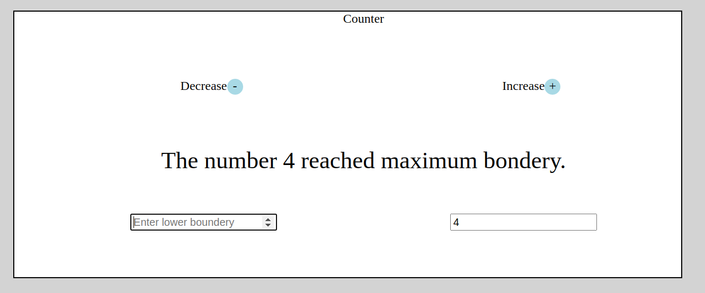

# _Counter_

#### _Version 1_
#### _Date 08/24/2020_
#### By _**Adilet Momunaliev**_

## Description

_Counter increments and decrements value based on given bounderies._

## Getting Started

These instructions will get you a copy of the project up and running on your local machine for development and testing purposes.

### Instruction

* Node js in your local machine
* git clone https://github.com/Adilet312/CounterJS.git
* npm install
* npm run start
### Specifications
A user can increment and decrement value based on given bounderies.
;
## Technologies Used

_HTML, CSS, JavaScript, DOM Elements and Methods, IDE Atom_

### License

*_Copyright (c) 2020 **Adilet Momunaliev**_*
